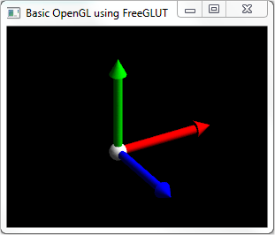

# OpenGL-Basic
A project to learn the basics of OpenGL.

##FreeGLUT
>FreeGLUT takes care of all the system-specific chores required for creating windows, initializing OpenGL contexts, and handling input events, to allow for trully portable OpenGL programs.

This will allow you to focus on OpenGL and not get bogged down with system specific nuances.

See [FreeGLUT](http://freeglut.sourceforge.net/) for more information.

## Build
    mkdir _build
    cd _build

*Linux*

    cmake .. -DFREEGLUT_BUILD_DEMOS=OFF -DFREEGLUT_BUILD_STATIC_LIBS=OFF
    make
    make install

*Windows*

    cmake .. -G "Visual Studio 10 Win64" -DFREEGLUT_BUILD_DEMOS=OFF -DFREEGLUT_BUILD_STATIC_LIBS=OFF
* Build using Visual Studio the solution
* Build `INSTALL.vcproj`

## Run
*Linux*

    export LD_LIBRARY_PATH=~/src/OpenGL-Basic/_install/lib64
    ~/src/OpenGL-Basic $ _install/bin/app

*Windows*

    D:\src\OpenGL-Basic>_install\bin\app.exe

## Application keys/commands
`+` zoom-in

`-` zoom-out

`x` or `X` rotate about X axis

`y` or `Y` rotate about Y axis

`z` or `Z` rotate about Z axis

`space` reset view

